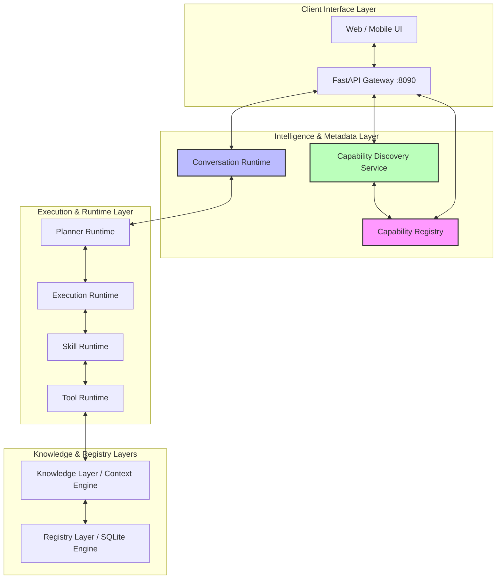

# DeepCore Architecture - Engine Foundation v0.2

This document outlines the system architecture of the DeepCore platform, describing its modular layering, reserved ports, core architectural laws, and capability discovery stack.

---

## System Layers

### 1. Ingestion / Source Layer
Manages the discovery and sync of external data sources into the system.
- **Markdown Connectors**: Watches and syncs local Markdown note folders.
- **YouTube Connectors**: Handles intake and metadata extraction for YouTube video URLs.

### 2. Registry Layer
Provides universal identity management for all tracked digital assets.
- **Universal Object Identity**: System-wide unique IDs and UUIDs for every registered entity.
- **Metadata Management**: Flexible metadata store (via JSON fields) preserving source metadata and timestamps.
- **Lifecycle Management**: Tracks and processes lifecycle states (e.g., active, merged, missing, archived).

### 3. Content Layer
Handles the extraction and indexing of raw text contents.
- **Deterministic Indexing**: Ensures each file has at most one corresponding indexed entry.
- **Content Hash Tracking**: Tracks SHA-256 hashes of contents to handle updates, re-indexing, and deduplication.
- **Content Search**: Case-insensitive substring query matching across all raw text.

### 4. Knowledge Layer
The semantic abstraction layer mapping extracted concepts and connections.
- **Concept Extraction**: Automatic parsing of headings, repeated phrases, and technical terms.
- **Relationships**: Typed registry relationships (e.g., "mentions") with confidence rankings.
- **Governance**: Candidate concept promotion (approval with classifications like `technology`, `tool`, etc.) or exclusion (ignoring concepts).

### 5. Execution Pipeline Layer
The deterministic execution engine for runtimes.
- **Tool Runtime**: Low-level isolated tool validation, execution, resources cost, and latency metrics.
- **Skill Runtime**: Composes multiple tool calls under deep recursive checks and execution characteristics.
- **Execution Runtime**: Duck-typed gateway resolving executable targets (skills and custom executables) by descriptor.
- **Planner Runtime**: Processes and schedules topological execution plans using a custom deterministic condition evaluator.
- **Conversation Runtime**: Coordinator and entry point, routing direct commands or compiling goals into planner requests.

### 6. Metadata & Discovery Layer
A separate, metadata-only layer for exposing capabilities to clients.
- **Descriptor Architecture**: Standardized, immutable metadata models (`BaseDescriptor` subclassing `ToolDescriptor`, `SkillDescriptor`, `ProviderDescriptor`, `ConversationDescriptor`, `PromptDescriptor`, `ModelDescriptor`).
- **Capability Registry**: Stores, unregisters, and lists descriptors in alphabetical order. Ensures globally unique IDs and performs pre-registration integrity validations.
- **Capability Discovery Service**: A stateless composition layer translating internal registry schemas to client-friendly models (`CapabilitySummary`, `CapabilityDetail`, `CapabilityCatalog`).

### 7. API Layer
Exposes DeepCore registry, knowledge, execution, and discovery capabilities via HTTP.
- **Client-Neutral JSON**: All responses conform strictly to client-neutral Pydantic models.
- **Web / iOS / Android Ready**: Raw data ready for presentation on PWA, desktop, or mobile platforms.

---

## Reserved System Ports

| Port | Service / Application | Description |
|---|---|---|
| **8000** | **FinSync Pro** | Personal fintech synchronizer app (EUR/INR E2EE app). |
| **8090** | **DeepCore API** | Local FastAPI server serving the DeepCore Registry Engine. |
| **11434** | **Ollama** | Local LLM server hosting offline models. |

---

## Architectural Laws

### 1. Descriptor Identity Law
A Descriptor is the immutable public identity of a capability.
- Runtime instances execute behavior.
- Descriptors describe behavior.
- Registries index descriptors.
- Frontends consume descriptors.
- Execution engines never depend on descriptor metadata to make runtime decisions.
- Descriptors exist to make capabilities discoverable, replaceable, and self-describing. They must not contain execution state or influence runtime behavior.

### 2. Registry Ownership Law
Every registry in DeepCore owns exactly one architectural concept.
- Examples:
  - Registry -> Objects
  - Tool Registry -> Tools
  - Skill Registry -> Skills
  - Capability Registry -> Descriptors
- Registries do not execute behavior.
- Registries expose deterministic lookup, validation, and discovery for the concepts they own.
- Execution always belongs to runtime components, never registries.
